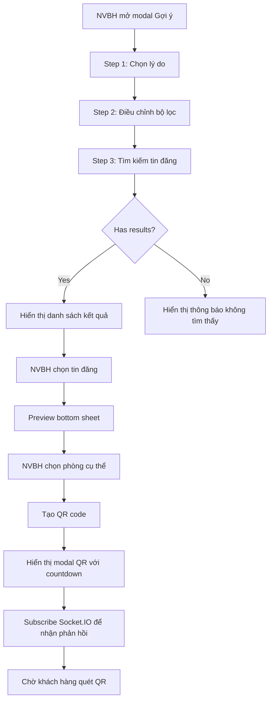
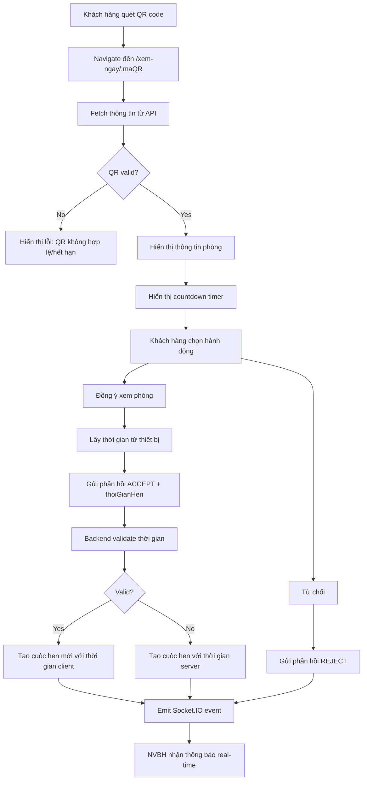
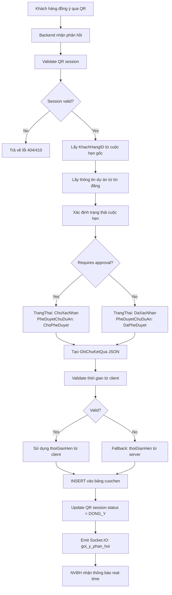
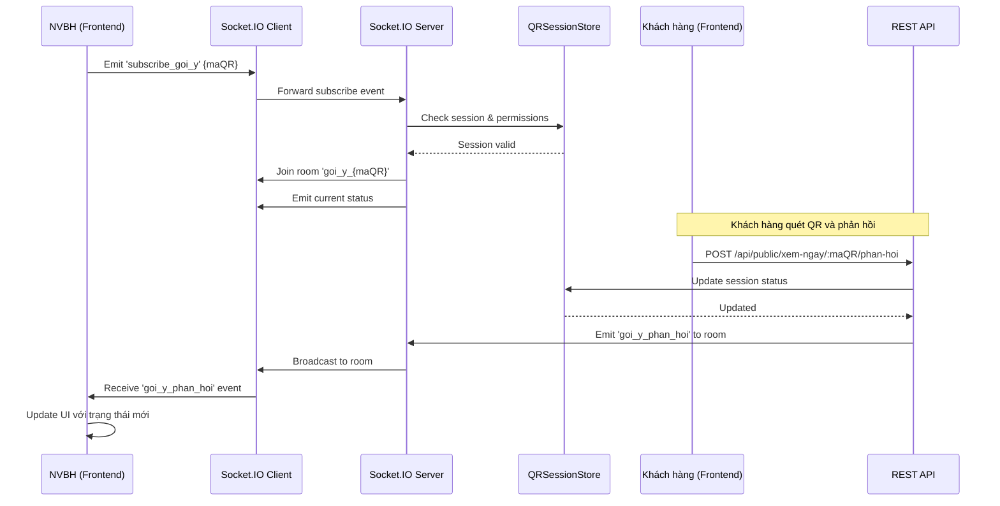
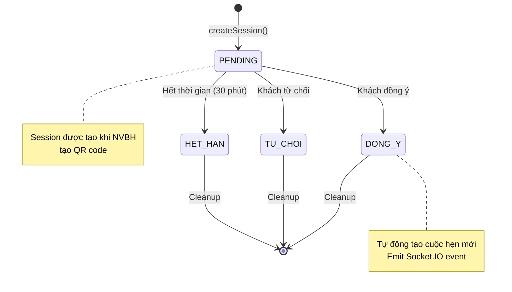

# Tài liệu kỹ thuật: Tính năng Gợi ý Tin đăng Phù hợp

**Phiên bản:** 1.0  
**Ngày cập nhật:** 2025-01-27  
**Tác giả:** Development Team

---

## Mục lục

1. [Tổng quan](#1-tổng-quan)
2. [Kiến trúc hệ thống](#2-kiến-trúc-hệ-thống)
3. [User Flows](#3-user-flows)
4. [API Documentation](#4-api-documentation)
5. [Database Schema](#5-database-schema)
6. [Frontend Components](#6-frontend-components)
7. [Backend Services](#7-backend-services)
8. [Real-time Communication](#8-real-time-communication)
9. [Error Handling](#9-error-handling)
10. [Security & Validation](#10-security--validation)
11. [Deployment Notes](#11-deployment-notes)

---

## 1. Tổng quan

### 1.1. Mô tả tính năng

Tính năng **Gợi ý Tin đăng Phù hợp** cho phép Nhân viên Bán hàng (NVBH) gợi ý các phòng khác cho khách hàng khi họ không ưng ý với phòng hiện tại trong cuộc hẹn. Tính năng này sử dụng QR code để khách hàng có thể xem thông tin chi tiết và phản hồi (đồng ý/từ chối) một cách nhanh chóng.

### 1.2. Mục đích

- **Tăng tỷ lệ chuyển đổi**: Giảm thiểu việc mất khách hàng khi họ không ưng ý phòng hiện tại
- **Tối ưu trải nghiệm**: Khách hàng có thể xem thông tin và phản hồi ngay trên thiết bị di động
- **Tự động hóa**: Tự động tạo cuộc hẹn mới khi khách hàng đồng ý xem phòng qua QR
- **Real-time updates**: NVBH nhận thông báo ngay lập tức khi khách hàng phản hồi

### 1.3. Use Cases

**UC-GOIY-01: NVBH tìm kiếm và tạo QR gợi ý**
- **Actor**: Nhân viên Bán hàng
- **Mô tả**: NVBH tìm kiếm tin đăng phù hợp dựa trên các tiêu chí lọc (khu vực, giá, diện tích, tiện ích) và tạo QR code "Xem Ngay" cho một phòng cụ thể
- **Tiền điều kiện**: NVBH đang trong cuộc hẹn với khách hàng
- **Hậu điều kiện**: QR code được tạo thành công, session được lưu trong QRSessionStore

**UC-GOIY-02: Khách hàng quét QR và phản hồi**
- **Actor**: Khách hàng
- **Mô tả**: Khách hàng quét QR code, xem thông tin phòng, và chọn đồng ý hoặc từ chối
- **Tiền điều kiện**: QR code hợp lệ và chưa hết hạn
- **Hậu điều kiện**: 
  - Nếu đồng ý: Cuộc hẹn mới được tạo tự động, NVBH nhận thông báo real-time
  - Nếu từ chối: Trạng thái QR được cập nhật, NVBH nhận thông báo

### 1.4. Actors

- **Nhân viên Bán hàng (NVBH)**: Người tìm kiếm và tạo QR gợi ý
- **Khách hàng**: Người quét QR và phản hồi

### 1.5. Business Value

- **Tăng tỷ lệ chuyển đổi**: Giảm mất khách hàng khi họ không ưng ý phòng hiện tại
- **Tối ưu quy trình**: Tự động hóa việc tạo cuộc hẹn mới, giảm thao tác thủ công
- **Cải thiện trải nghiệm**: Khách hàng có thể xem thông tin và phản hồi ngay trên điện thoại
- **Real-time tracking**: NVBH theo dõi trạng thái phản hồi của khách hàng theo thời gian thực

---

## 2. Kiến trúc hệ thống

### 2.1. Architecture Overview

Tính năng được xây dựng trên kiến trúc 3 tầng:

```
┌─────────────────────────────────────────────────────────────┐
│                    Frontend (React)                          │
│  ┌──────────────┐  ┌──────────────┐  ┌──────────────┐      │
│  │ ModalGoiY    │  │ ModalQR      │  │ XemNgay      │      │
│  │ PhongKhac    │  │ XemNgay      │  │ Confirm      │      │
│  └──────────────┘  └──────────────┘  └──────────────┘      │
│         │                  │                  │             │
│         └──────────────────┼──────────────────┘             │
│                            │                                 │
│                    ┌───────▼───────┐                         │
│                    │ useGoiYSocket │                         │
│                    │   (Socket.IO) │                         │
│                    └───────┬───────┘                         │
└────────────────────────────┼─────────────────────────────────┘
                             │
┌────────────────────────────▼─────────────────────────────────┐
│              Backend (Node.js/Express)                       │
│  ┌──────────────┐  ┌──────────────┐  ┌──────────────┐      │
│  │   Routes     │  │ Controllers  │  │    Models    │      │
│  │              │  │              │  │              │      │
│  │ goiYRoutes   │  │ GoiYTinDang  │  │ GoiYTinDang  │      │
│  │ publicRoutes │  │ Controller   │  │ Model        │      │
│  └──────┬───────┘  └──────┬───────┘  └──────┬───────┘      │
│         │                 │                 │               │
│         └─────────────────┼─────────────────┘               │
│                           │                                  │
│                    ┌──────▼───────┐                          │
│                    │ QRSessionStore│                         │
│                    │  (In-Memory)  │                         │
│                    └──────┬───────┘                          │
│                           │                                  │
│                    ┌──────▼───────┐                          │
│                    │ Socket.IO    │                          │
│                    │   Server     │                          │
│                    └─────────────┘                          │
└────────────────────────────┬─────────────────────────────────┘
                             │
┌────────────────────────────▼─────────────────────────────────┐
│                    Database (MySQL)                           │
│  ┌──────────┐  ┌──────────┐  ┌──────────┐  ┌──────────┐   │
│  │ tindang  │  │  phong   │  │ cuochen  │  │ khuvuc   │   │
│  └──────────┘  └──────────┘  └──────────┘  └──────────┘   │
└───────────────────────────────────────────────────────────────┘
```

### 2.2. Technology Stack

**Frontend:**
- React 18+ với Hooks
- React Router DOM cho routing
- Framer Motion cho animations
- Socket.IO Client cho real-time communication
- qrcode.react cho QR code generation
- react-icons/hi2 cho icons

**Backend:**
- Node.js với Express
- Socket.IO Server cho real-time communication
- MySQL2 cho database queries
- crypto (built-in) cho QR code generation

**Storage:**
- MySQL cho persistent data
- In-memory Map (QRSessionStore) cho QR sessions

### 2.3. Component Overview

**Frontend Components:**
- `ModalGoiYPhongKhac`: Wizard 3 bước (Lý do → Bộ lọc → Kết quả)
- `PreviewTinDangSheet`: Bottom sheet hiển thị chi tiết tin đăng
- `ModalQRXemNgay`: Modal hiển thị QR code với countdown timer
- `XemNgayConfirm`: Trang public cho khách hàng quét QR

**Backend Services:**
- `GoiYTinDangModel`: Database queries
- `GoiYTinDangController`: Business logic
- `QRSessionStore`: In-memory session management
- `goiYHandlers`: Socket.IO event handlers

---

## 3. User Flows

### 3.1. Flow chính: NVBH tìm kiếm và tạo QR



### 3.2. Flow khách hàng quét QR và phản hồi



### 3.3. Flow tạo cuộc hẹn tự động khi khách đồng ý



### 3.4. Flow Socket.IO Real-time Communication



### 3.5. Flow QRSessionStore Lifecycle



---

## 4. API Documentation

### 4.1. Authenticated Routes (NVBH)

#### POST `/api/nhan-vien-ban-hang/goi-y/tim-kiem`

Tìm kiếm tin đăng phù hợp để gợi ý cho khách hàng.

**Authentication**: Required (JWT token)  
**Authorization**: Role `NhanVienBanHang`

**Request Body:**
```json
{
  "cuocHenId": 123,
  "khuVucId": 5,
  "giaMin": 2000000,
  "giaMax": 5000000,
  "dienTichMin": 20,
  "dienTichMax": 40,
  "tienIch": "Điều hòa, Wifi",
  "limit": 10
}
```

**Response (200 OK):**
```json
{
  "success": true,
  "data": {
    "tinDangList": [
      {
        "TinDangID": 456,
        "TieuDe": "Phòng trọ đẹp, gần trung tâm",
        "MoTa": "Phòng rộng rãi, thoáng mát...",
        "TenDuAn": "Chung cư ABC",
        "DiaChi": "123 Đường XYZ",
        "GiaThapNhat": 2500000,
        "GiaCaoNhat": 3500000,
        "DienTichMin": 25,
        "DienTichMax": 35,
        "SoPhongTrong": 3,
        "HinhAnh": "https://example.com/image.jpg"
      }
    ],
    "khuVucList": [
      {
        "KhuVucID": 5,
        "TenKhuVuc": "Quận 1"
      }
    ]
  },
  "message": "Tìm thấy 5 tin đăng phù hợp"
}
```

**Error Responses:**
- `400 Bad Request`: Thiếu thông tin bắt buộc
- `401 Unauthorized`: Token không hợp lệ
- `403 Forbidden`: Không có quyền truy cập
- `500 Internal Server Error`: Lỗi server

---

#### GET `/api/nhan-vien-ban-hang/goi-y/khu-vuc`

Lấy danh sách khu vực con dựa trên khu vực phụ trách của NVBH.

**Authentication**: Required (JWT token)  
**Authorization**: Role `NhanVienBanHang`

**Response (200 OK):**
```json
{
  "success": true,
  "data": [
    {
      "KhuVucID": 5,
      "TenKhuVuc": "Quận 1",
      "ParentKhuVucID": 1
    },
    {
      "KhuVucID": 6,
      "TenKhuVuc": "Quận 2",
      "ParentKhuVucID": 1
    }
  ]
}
```

---

#### GET `/api/nhan-vien-ban-hang/goi-y/tin-dang/:tinDangId`

Lấy chi tiết tin đăng gợi ý (bao gồm danh sách phòng trống).

**Authentication**: Required (JWT token)  
**Authorization**: Role `NhanVienBanHang`

**Response (200 OK):**
```json
{
  "success": true,
  "data": {
    "TinDangID": 456,
    "TieuDe": "Phòng trọ đẹp",
    "MoTa": "Mô tả chi tiết...",
    "TenDuAn": "Chung cư ABC",
    "DiaChi": "123 Đường XYZ",
    "DanhSachPhongTrong": [
      {
        "PhongID": 789,
        "TenPhong": "Phòng 101",
        "Gia": 2500000,
        "DienTich": 25,
        "MoTaPhong": "Phòng đẹp, view đẹp"
      }
    ],
    "HinhAnh": [
      {
        "DuongDan": "https://example.com/img1.jpg",
        "ThuTu": 1
      }
    ]
  }
}
```

---

#### POST `/api/nhan-vien-ban-hang/goi-y/tao-qr`

Tạo QR code "Xem Ngay" cho một phòng cụ thể.

**Authentication**: Required (JWT token)  
**Authorization**: Role `NhanVienBanHang`

**Request Body:**
```json
{
  "cuocHenId": 123,
  "tinDangId": 456,
  "phongId": 789
}
```

**Response (200 OK):**
```json
{
  "success": true,
  "data": {
    "maQR": "a1b2c3d4e5f6",
    "qrUrl": "/xem-ngay/a1b2c3d4e5f6",
    "thoiGianConLai": 1800,
    "hetHanLuc": 1706342400000,
    "thongTinPhong": {
      "PhongID": 789,
      "TenPhong": "Phòng 101",
      "Gia": 2500000,
      "DienTich": 25,
      "DiaChi": "123 Đường XYZ",
      "TenDuAn": "Chung cư ABC"
    }
  },
  "message": "Tạo QR thành công"
}
```

**Error Responses:**
- `400 Bad Request`: Phòng không còn trống hoặc thiếu thông tin
- `404 Not Found`: Không tìm thấy phòng/tin đăng
- `500 Internal Server Error`: Lỗi server

---

#### GET `/api/nhan-vien-ban-hang/goi-y/trang-thai/:maQR`

Kiểm tra trạng thái QR (polling fallback).

**Authentication**: Required (JWT token)  
**Authorization**: Role `NhanVienBanHang`

**Response (200 OK):**
```json
{
  "success": true,
  "data": {
    "maQR": "a1b2c3d4e5f6",
    "trangThai": "CHO_PHAN_HOI",
    "thoiGianConLai": 1500,
    "phanHoiLuc": null
  }
}
```

---

### 4.2. Public Routes (Khách hàng)

#### GET `/api/public/xem-ngay/:maQR`

Xem thông tin phòng từ mã QR (public, không cần authentication).

**Request Parameters:**
- `maQR` (path): Mã QR duy nhất

**Response (200 OK):**
```json
{
  "success": true,
  "data": {
    "maQR": "a1b2c3d4e5f6",
    "trangThai": "CHO_PHAN_HOI",
    "thoiGianConLai": 1800,
    "thongTinPhong": {
      "PhongID": 789,
      "TenPhong": "Phòng 101",
      "GiaChuan": 2500000,
      "DienTichChuan": 25,
      "MoTaPhong": "Phòng đẹp, view đẹp",
      "HinhAnhPhong": "https://example.com/img.jpg",
      "TenDuAn": "Chung cư ABC",
      "DiaChi": "123 Đường XYZ",
      "ViDo": 10.123456,
      "KinhDo": 106.123456
    },
    "thongTinTinDang": {
      "TinDangID": 456,
      "TieuDe": "Phòng trọ đẹp",
      "DiaChi": "123 Đường XYZ",
      "TenDuAn": "Chung cư ABC",
      "GiaDien": 3000,
      "GiaNuoc": 20000,
      "GiaDichVu": 100000,
      "TienIch": "Điều hòa, Wifi, Tủ lạnh",
      "ViDo": 10.123456,
      "KinhDo": 106.123456
    }
  }
}
```

**Error Responses:**
- `404 Not Found`: Mã QR không tồn tại
- `410 Gone`: Mã QR đã hết hạn
- `409 Conflict`: Đã phản hồi rồi

---

#### POST `/api/public/xem-ngay/:maQR/phan-hoi`

Phản hồi QR (đồng ý/từ chối xem phòng).

**Request Parameters:**
- `maQR` (path): Mã QR duy nhất

**Request Body:**
```json
{
  "dongY": true,
  "thoiGianHen": "2025-01-28T10:30:00Z"
}
```

**Response (200 OK) - Đồng ý:**
```json
{
  "success": true,
  "data": {
    "maQR": "a1b2c3d4e5f6",
    "trangThai": "DONG_Y",
    "message": "Cảm ơn bạn đã xác nhận! Cuộc hẹn đã được tạo tự động.",
    "cuocHenMoiId": 124,
    "thongTinLienHe": {
      "tenNhanVien": "Nguyễn Văn A",
      "soDienThoai": "0901234567",
      "diaChi": "123 Đường XYZ",
      "tenDuAn": "Chung cư ABC",
      "viDo": 10.123456,
      "kinhDo": 106.123456
    }
  }
}
```

**Response (200 OK) - Từ chối:**
```json
{
  "success": true,
  "data": {
    "maQR": "a1b2c3d4e5f6",
    "trangThai": "TU_CHOI",
    "message": "Đã ghi nhận phản hồi của bạn"
  }
}
```

**Error Responses:**
- `400 Bad Request`: Thiếu thông tin hoặc format không hợp lệ
- `404 Not Found`: Mã QR không tồn tại
- `409 Conflict`: Đã phản hồi rồi
- `410 Gone`: Mã QR đã hết hạn
- `500 Internal Server Error`: Lỗi server

---

## 5. Database Schema

### 5.1. Tables liên quan

#### Bảng `tindang`
Lưu thông tin tin đăng được gợi ý.

**Các cột quan trọng:**
- `TinDangID` (PK): ID tin đăng
- `DuAnID` (FK): ID dự án
- `KhuVucID` (FK): ID khu vực
- `TieuDe`: Tiêu đề tin đăng
- `MoTa`: Mô tả chi tiết
- `TienIch`: Tiện ích (JSON hoặc text)
- `TrangThai`: Trạng thái (DaDang, DaDuyet, ChoDuyet)
- `URL`: Hình ảnh (JSON array)

#### Bảng `phong`
Lưu thông tin phòng được gợi ý.

**Các cột quan trọng:**
- `PhongID` (PK): ID phòng
- `DuAnID` (FK): ID dự án
- `TenPhong`: Tên phòng
- `TrangThai`: Trạng thái (Trong, GiuCho, DaThue)
- `GiaChuan`: Giá chuẩn
- `DienTichChuan`: Diện tích chuẩn
- `MoTaPhong`: Mô tả phòng
- `HinhAnhPhong`: Hình ảnh phòng

#### Bảng `phong_tindang`
Liên kết phòng với tin đăng.

**Các cột quan trọng:**
- `PhongID` (FK): ID phòng
- `TinDangID` (FK): ID tin đăng
- `GiaTinDang`: Giá trong tin đăng (override GiaChuan)
- `DienTichTinDang`: Diện tích trong tin đăng (override DienTichChuan)
- `HinhAnhTinDang`: Hình ảnh trong tin đăng
- `ThuTuHienThi`: Thứ tự hiển thị

#### Bảng `cuochen`
Lưu cuộc hẹn được tạo tự động khi khách đồng ý.

**Các cột quan trọng:**
- `CuocHenID` (PK): ID cuộc hẹn
- `PhongID` (FK): ID phòng
- `TinDangID` (FK): ID tin đăng
- `ChuDuAnID` (FK): ID chủ dự án
- `KhachHangID` (FK): ID khách hàng
- `NhanVienBanHangID` (FK): ID nhân viên bán hàng
- `ThoiGianHen`: Thời gian hẹn (từ thiết bị khách hàng hoặc server)
- `TrangThai`: Trạng thái (ChoXacNhan, DaXacNhan, ...)
- `PheDuyetChuDuAn`: Phê duyệt chủ dự án (ChoPheDuyet, DaPheDuyet)
- `GhiChu`: Ghi chú
- `GhiChuKetQua`: JSON lịch sử hoạt động

#### Bảng `khuvuc`
Lưu thông tin khu vực.

**Các cột quan trọng:**
- `KhuVucID` (PK): ID khu vực
- `TenKhuVuc`: Tên khu vực
- `ParentKhuVucID` (FK): ID khu vực cha (null nếu là root)

#### Bảng `hosonhanvien`
Lưu thông tin hồ sơ nhân viên.

**Các cột quan trọng:**
- `NguoiDungID` (FK): ID người dùng
- `KhuVucPhuTrachID` (FK): ID khu vực phụ trách

### 5.2. QRSessionStore Structure

QRSessionStore là in-memory store (Map) lưu trữ các QR sessions.

**Session Object:**
```javascript
{
  maQR: string,              // Mã QR duy nhất (12 ký tự)
  nhanVienId: number,        // ID nhân viên bán hàng
  cuocHenId: number | null,  // ID cuộc hẹn gốc
  tinDangId: number,         // ID tin đăng được gợi ý
  phongId: number,           // ID phòng được chọn
  trangThai: string,         // CHO_PHAN_HOI | DONG_Y | TU_CHOI | HET_HAN
  thongTinPhong: Object,     // Cache thông tin phòng
  thongTinTinDang: Object,   // Cache thông tin tin đăng
  thongTinNhanVien: Object,  // Cache thông tin NVBH
  taoLuc: number,           // Timestamp tạo (ms)
  hetHanLuc: number,        // Timestamp hết hạn (ms)
  phanHoiLuc: number | null // Timestamp phản hồi (ms)
}
```

**Lifecycle:**
- Tạo khi NVBH tạo QR: `trangThai = CHO_PHAN_HOI`
- Hết hạn sau 30 phút: `trangThai = HET_HAN`
- Khi khách đồng ý: `trangThai = DONG_Y`
- Khi khách từ chối: `trangThai = TU_CHOI`
- Cleanup tự động sau 1 giờ kể từ khi hết hạn hoặc phản hồi

---

## 6. Frontend Components

### 6.1. ModalGoiYPhongKhac

**File**: `client/src/components/NhanVienBanHang/ModalGoiYPhongKhac/ModalGoiYPhongKhac.jsx`

**Mô tả**: Wizard 3 bước để NVBH tìm kiếm và chọn tin đăng gợi ý.

**Props:**
```typescript
{
  isOpen: boolean;
  onClose: () => void;
  cuocHenId: number;
  tinDangHienTai: Object | null;
  onViewDetail: (tinDangId: number) => void;
  onCreateQR: (data: { cuocHenId: number; tinDangId: number; phongId: number }) => void;
}
```

**State:**
- `currentStep`: Bước hiện tại (1, 2, 3)
- `lyDo`: Lý do khách không ưng ý
- `ghiChu`: Ghi chú bổ sung
- `filters`: Bộ lọc tìm kiếm
- `results`: Danh sách kết quả
- `selectedTinDang`: Tin đăng được chọn
- `loading`: Trạng thái loading
- `error`: Lỗi (nếu có)

**Steps:**
1. **Step 1 - Lý do**: Chọn lý do khách không ưng ý
2. **Step 2 - Bộ lọc**: Điều chỉnh tiêu chí tìm kiếm (khu vực, giá, diện tích, tiện ích)
3. **Step 3 - Kết quả**: Hiển thị danh sách tin đăng, chọn tin đăng để xem chi tiết

---

### 6.2. PreviewTinDangSheet

**File**: `client/src/components/NhanVienBanHang/PreviewTinDangSheet.jsx`

**Mô tả**: Bottom sheet hiển thị chi tiết tin đăng và danh sách phòng trống.

**Props:**
```typescript
{
  isOpen: boolean;
  onClose: () => void;
  tinDangId: number;
  onSelectRoom: (phongId: number) => void;
}
```

**State:**
- `tinDang`: Chi tiết tin đăng
- `phongList`: Danh sách phòng trống
- `loading`: Trạng thái loading
- `error`: Lỗi (nếu có)

**Features:**
- Hiển thị hình ảnh, mô tả, tiện ích
- Danh sách phòng trống với giá và diện tích
- Chọn phòng để tạo QR

---

### 6.3. ModalQRXemNgay

**File**: `client/src/components/NhanVienBanHang/ModalQRXemNgay.jsx`

**Mô tả**: Modal hiển thị QR code với countdown timer và real-time status updates.

**Props:**
```typescript
{
  isOpen: boolean;
  onClose: () => void;
  maQR: string;
  qrUrl: string;
  thoiGianConLai: number;
}
```

**State:**
- `trangThai`: Trạng thái QR (từ useGoiYSocket)
- `thoiGianConLai`: Thời gian còn lại (từ useGoiYSocket)
- `phanHoi`: Phản hồi từ khách (từ useGoiYSocket)

**Features:**
- Hiển thị QR code (qrcode.react)
- Countdown timer real-time
- Real-time status updates qua Socket.IO
- Hiển thị thông báo khi khách phản hồi

**Hooks:**
- `useGoiYSocket(maQR)`: Subscribe vào QR session để nhận updates

---

### 6.4. XemNgayConfirm

**File**: `client/src/pages/XemNgay/XemNgayConfirm.jsx`

**Mô tả**: Trang public cho khách hàng quét QR và phản hồi.

**Route**: `/xem-ngay/:maQR`

**State:**
- `loading`: Trạng thái loading
- `submitting`: Trạng thái đang gửi phản hồi
- `error`: Lỗi (nếu có)
- `sessionData`: Thông tin session từ API
- `trangThai`: Trạng thái QR
- `thoiGianConLai`: Thời gian còn lại (countdown)
- `thongTinLienHe`: Thông tin liên hệ NVBH (sau khi đồng ý)

**Features:**
- Hiển thị thông tin phòng và tin đăng
- Countdown timer
- Nút "Đồng ý" và "Từ chối"
- Form chọn thời gian hẹn (khi đồng ý)
- Hiển thị thông tin liên hệ sau khi đồng ý
- Glassmorphism UI design

---

### 6.5. useGoiYSocket Hook

**File**: `client/src/hooks/useGoiYSocket.js`

**Mô tả**: Custom hook quản lý Socket.IO communication cho tính năng gợi ý.

**Usage:**
```javascript
const { trangThai, thoiGianConLai, phanHoi, isWaiting, subscribe, unsubscribe } = useGoiYSocket(maQR);
```

**Returns:**
- `trangThai`: Trạng thái QR (CHO_PHAN_HOI, DONG_Y, TU_CHOI, HET_HAN)
- `thoiGianConLai`: Thời gian còn lại (giây)
- `phanHoi`: Phản hồi từ khách (null hoặc object)
- `isWaiting`: Đang chờ phản hồi
- `isConnected`: Socket đã kết nối
- `error`: Lỗi (nếu có)
- `subscribe(qrCode)`: Subscribe vào QR session
- `unsubscribe()`: Unsubscribe khỏi QR session
- `checkStatus()`: Kiểm tra trạng thái (polling fallback)

**Socket Events:**
- `subscribe_goi_y`: Subscribe vào QR session
- `unsubscribe_goi_y`: Unsubscribe
- `subscribed_goi_y`: Xác nhận đã subscribe
- `goi_y_phan_hoi`: Nhận phản hồi từ khách
- `goi_y_status`: Trạng thái QR (polling)
- `error`: Lỗi

---

## 7. Backend Services

### 7.1. GoiYTinDangModel

**File**: `server/models/GoiYTinDangModel.js`

**Mô tả**: Model xử lý database queries cho tính năng gợi ý.

**Methods:**

#### `timKiemGoiY(filters)`
Tìm kiếm tin đăng gợi ý theo bộ lọc.

**Parameters:**
```javascript
{
  khuVucId: number | Array<number> | null,
  giaMin: number | null,
  giaMax: number | null,
  dienTichMin: number | null,
  dienTichMax: number | null,
  tienIch: string | null,
  excludeTinDangId: number | null,
  limit: number (default: 10)
}
```

**Returns**: `Promise<Array>` - Danh sách tin đăng

**Logic:**
- Chỉ lấy tin đăng có trạng thái `DaDang`, `DaDuyet`, hoặc `ChoDuyet`
- Chỉ lấy tin đăng có phòng trống (`TrangThai = 'Trong'`)
- Filter theo khu vực (hỗ trợ array các child IDs)
- Filter theo giá (dựa trên giá phòng trống)
- Filter theo diện tích (dựa trên diện tích phòng trống)
- Filter theo tiện ích (LIKE pattern)
- Loại trừ tin đăng gốc (nếu có)
- Sắp xếp theo số phòng trống giảm dần, sau đó theo `CapNhatLuc`

---

#### `layDanhSachPhongTrong(tinDangId)`
Lấy danh sách phòng trống của tin đăng.

**Parameters:**
- `tinDangId`: number

**Returns**: `Promise<Array>` - Danh sách phòng trống

---

#### `layChiTietTinDangGoiY(tinDangId)`
Lấy chi tiết tin đăng gợi ý (bao gồm danh sách phòng trống).

**Parameters:**
- `tinDangId`: number

**Returns**: `Promise<Object|null>` - Chi tiết tin đăng

---

#### `kiemTraPhongConTrong(phongId)`
Kiểm tra phòng còn trống không.

**Parameters:**
- `phongId`: number

**Returns**: `Promise<boolean>`

---

#### `layChiTietPhong(phongId)`
Lấy thông tin chi tiết phòng.

**Parameters:**
- `phongId`: number

**Returns**: `Promise<Object|null>`

---

#### `layDanhSachKhuVucCon(parentKhuVucId)`
Lấy danh sách khu vực con dựa trên ParentKhuVucID.

**Parameters:**
- `parentKhuVucId`: number

**Returns**: `Promise<Array>` - Danh sách khu vực con

---

#### `layDanhSachKhuVuc()`
Lấy danh sách tất cả khu vực (cho dropdown).

**Returns**: `Promise<Array>` - Danh sách khu vực

---

### 7.2. GoiYTinDangController

**File**: `server/controllers/GoiYTinDangController.js`

**Mô tả**: Controller xử lý business logic cho tính năng gợi ý.

**Methods:**

#### `timKiemGoiY(req, res)`
Tìm kiếm tin đăng gợi ý.

**Logic:**
1. Lấy `KhuVucPhuTrachID` từ hồ sơ NVBH
2. Lấy danh sách khu vực con từ parent ID
3. Lấy `TinDangID` từ cuộc hẹn gốc (để loại trừ)
4. Gọi `GoiYTinDangModel.timKiemGoiY()` với filters
5. Trả về kết quả và danh sách khu vực con

---

#### `layDanhSachKhuVuc(req, res)`
Lấy danh sách khu vực con dựa trên khu vực phụ trách của NVBH.

---

#### `layChiTietTinDang(req, res)`
Lấy chi tiết tin đăng gợi ý.

---

#### `taoQRXemNgay(req, res)`
Tạo QR code "Xem Ngay".

**Logic:**
1. Validate `tinDangId` và `phongId`
2. Kiểm tra phòng còn trống không
3. Lấy thông tin phòng, tin đăng, và NVBH
4. Tạo mã QR unique (12 ký tự)
5. Lưu session vào QRSessionStore
6. Trả về `maQR`, `qrUrl`, và thông tin phòng

---

#### `xemQRXemNgay(req, res)`
Xem thông tin QR (public).

**Logic:**
1. Lấy session từ QRSessionStore
2. Kiểm tra session tồn tại và chưa hết hạn
3. Kiểm tra trạng thái (chỉ cho phép `CHO_PHAN_HOI`)
4. Tính thời gian còn lại
5. Trả về thông tin phòng và tin đăng (không trả về thông tin NVBH)

---

#### `phanHoiQRXemNgay(req, res)`
Phản hồi QR (public).

**Logic:**
1. Validate session và trạng thái
2. Cập nhật trạng thái session (`DONG_Y` hoặc `TU_CHOI`)
3. **Nếu đồng ý:**
   - Lấy `KhachHangID` từ cuộc hẹn gốc
   - Lấy thông tin dự án và `ChuDuAnID`
   - Xác định trạng thái cuộc hẹn dựa trên `YeuCauPheDuyetChu`
   - Validate thời gian từ client (cho phép 5 phút lệch)
   - Tạo `GhiChuKetQua` JSON với lịch sử
   - INSERT vào bảng `cuochen`
   - Ghi nhật ký hệ thống
4. Emit Socket.IO event `goi_y_phan_hoi` đến room
5. Trả về kết quả (nếu đồng ý, trả về thông tin liên hệ NVBH)

---

#### `kiemTraTrangThaiQR(req, res)`
Kiểm tra trạng thái QR (polling fallback).

---

### 7.3. QRSessionStore

**File**: `server/services/QRSessionStore.js`

**Mô tả**: In-memory store quản lý QR sessions với auto-expiration.

**Methods:**

#### `create(sessionData, expiryMs)`
Tạo session mới.

**Parameters:**
```javascript
{
  maQR: string,
  nhanVienId: number,
  cuocHenId: number | null,
  tinDangId: number,
  phongId: number,
  thongTinPhong: Object,
  thongTinTinDang: Object,
  thongTinNhanVien: Object
}
```

**Returns**: `QRSession` object

---

#### `get(maQR)`
Lấy session theo mã QR.

**Returns**: `QRSession | null`

**Logic:**
- Kiểm tra session tồn tại
- Tự động đánh dấu hết hạn nếu `hetHanLuc < Date.now()`

---

#### `updateStatus(maQR, trangThai)`
Cập nhật trạng thái session.

**Parameters:**
- `maQR`: string
- `trangThai`: `DONG_Y` | `TU_CHOI` | `HET_HAN`

**Returns**: `QRSession | null`

**Logic:**
- Chỉ cho phép cập nhật nếu `trangThai === 'CHO_PHAN_HOI'`
- Set `phanHoiLuc = Date.now()`

---

#### `remove(maQR)`
Xóa session.

**Returns**: `boolean`

---

#### `cleanup()`
Dọn dẹp sessions hết hạn.

**Logic:**
- Xóa sessions đã hết hạn quá 1 giờ
- Xóa sessions đã phản hồi quá 1 giờ
- Chạy tự động mỗi 5 phút

---

#### `getRemainingTime(maQR)`
Lấy thời gian còn lại (giây).

**Returns**: `number` (0 nếu hết hạn)

---

### 7.4. goiYHandlers

**File**: `server/socket/goiYHandlers.js`

**Mô tả**: Socket.IO event handlers cho tính năng gợi ý.

**Events:**

#### `subscribe_goi_y`
NVBH subscribe vào QR session để nhận thông báo.

**Data:**
```javascript
{ maQR: string }
```

**Logic:**
1. Validate `maQR`
2. Kiểm tra session tồn tại và thuộc về user này
3. Join room `goi_y_{maQR}`
4. Emit `subscribed_goi_y` với trạng thái hiện tại
5. Nếu session đã có phản hồi, emit `goi_y_phan_hoi` ngay

---

#### `unsubscribe_goi_y`
NVBH unsubscribe khỏi QR session.

**Data:**
```javascript
{ maQR: string }
```

**Logic:**
1. Leave room `goi_y_{maQR}`
2. Emit `unsubscribed_goi_y`

---

#### `check_goi_y_status`
Kiểm tra trạng thái QR (polling fallback).

**Data:**
```javascript
{ maQR: string }
```

**Logic:**
1. Lấy session từ QRSessionStore
2. Emit `goi_y_status` với trạng thái hiện tại

---

## 8. Real-time Communication

### 8.1. Socket.IO Events

#### Client → Server

**`subscribe_goi_y`**
```javascript
socket.emit('subscribe_goi_y', { maQR: 'a1b2c3d4e5f6' });
```

**`unsubscribe_goi_y`**
```javascript
socket.emit('unsubscribe_goi_y', { maQR: 'a1b2c3d4e5f6' });
```

**`check_goi_y_status`**
```javascript
socket.emit('check_goi_y_status', { maQR: 'a1b2c3d4e5f6' });
```

---

#### Server → Client

**`subscribed_goi_y`**
```javascript
socket.on('subscribed_goi_y', ({ maQR, trangThai, thoiGianConLai }) => {
  // Xác nhận đã subscribe
});
```

**`goi_y_phan_hoi`**
```javascript
socket.on('goi_y_phan_hoi', ({ maQR, trangThai, phanHoiLuc, cuocHenMoiId }) => {
  // Nhận phản hồi từ khách hàng
});
```

**`goi_y_status`**
```javascript
socket.on('goi_y_status', ({ maQR, trangThai, thoiGianConLai, phanHoiLuc }) => {
  // Trạng thái QR (polling)
});
```

**`error`**
```javascript
socket.on('error', ({ event, message }) => {
  // Lỗi từ server
});
```

---

### 8.2. Room Management

**Room naming**: `goi_y_{maQR}`

**Ví dụ**: `goi_y_a1b2c3d4e5f6`

**Logic:**
- Mỗi QR session có một room riêng
- NVBH join room khi subscribe
- Server emit `goi_y_phan_hoi` đến room khi khách phản hồi
- Tất cả NVBH trong room nhận được event

---

### 8.3. Authorization

**Kiểm tra quyền:**
- Chỉ NVBH tạo QR mới có thể subscribe vào session đó
- Server kiểm tra `session.nhanVienId === socket.user.NguoiDungID`
- Nếu không có quyền, emit error event

---

## 9. Error Handling

### 9.1. Error Codes

| HTTP Code | Mô tả | Khi nào xảy ra |
|-----------|-------|----------------|
| 400 | Bad Request | Thiếu thông tin bắt buộc, format không hợp lệ |
| 401 | Unauthorized | Token không hợp lệ hoặc hết hạn |
| 403 | Forbidden | Không có quyền truy cập (không phải NVBH tạo QR) |
| 404 | Not Found | Mã QR không tồn tại, phòng/tin đăng không tìm thấy |
| 409 | Conflict | Đã phản hồi rồi, session không ở trạng thái `CHO_PHAN_HOI` |
| 410 | Gone | Mã QR đã hết hạn |
| 500 | Internal Server Error | Lỗi server (database, network, ...) |

---

### 9.2. Error Messages

**Frontend:**
- Hiển thị error message từ API response
- Toast notification cho lỗi real-time
- Fallback UI khi không có kết quả

**Backend:**
- Log chi tiết lỗi vào console
- Trả về error message thân thiện với người dùng
- Không expose thông tin nhạy cảm (database errors, stack traces)

---

### 9.3. Fallback Strategies

**Socket.IO không kết nối:**
- Sử dụng polling qua `check_goi_y_status` event
- Hoặc polling qua REST API `GET /api/nhan-vien-ban-hang/goi-y/trang-thai/:maQR`

**Thời gian từ client không hợp lệ:**
- Fallback về thời gian server
- Log warning để debug

**Phòng không còn trống sau khi tạo QR:**
- Khi khách quét QR, kiểm tra lại trạng thái phòng
- Nếu không còn trống, trả về lỗi 404

**Session hết hạn:**
- Tự động đánh dấu `HET_HAN` khi `hetHanLuc < Date.now()`
- Cleanup tự động sau 1 giờ

---

## 10. Security & Validation

### 10.1. Authentication

**Authenticated Routes:**
- Tất cả routes `/api/nhan-vien-ban-hang/goi-y/*` yêu cầu JWT token
- Token được validate qua middleware `auth`
- Token được lấy từ `Authorization: Bearer <token>` header

**Public Routes:**
- Routes `/api/public/xem-ngay/*` không yêu cầu authentication
- Nhưng vẫn validate mã QR để đảm bảo tính hợp lệ

---

### 10.2. Authorization

**NVBH Routes:**
- Chỉ NVBH mới có thể truy cập routes `/api/nhan-vien-ban-hang/goi-y/*`
- Kiểm tra role qua middleware `checkRole(['NhanVienBanHang'])`

**Socket.IO:**
- Chỉ NVBH tạo QR mới có thể subscribe vào session đó
- Server kiểm tra `session.nhanVienId === socket.user.NguoiDungID`

---

### 10.3. Input Validation

**QR Code:**
- Format: 12 ký tự alphanumeric (A-Z, a-z, 0-9)
- Generated bằng `crypto.randomBytes()` để đảm bảo tính ngẫu nhiên

**Thời gian từ client:**
- Format: ISO string (`YYYY-MM-DDTHH:mm:ssZ`) hoặc MySQL datetime (`YYYY-MM-DD HH:mm:ss`)
- Validate: Không được là quá khứ (cho phép 5 phút lệch)
- Validate: Không được quá xa tương lai (tối đa 1 năm)
- Fallback: Sử dụng thời gian server nếu không hợp lệ

**Filters:**
- `giaMin`, `giaMax`: Số dương
- `dienTichMin`, `dienTichMax`: Số dương
- `limit`: Số nguyên dương (default: 10, max: 100)

---

### 10.4. Data Protection

**Session Data:**
- Không lưu thông tin nhạy cảm trong QRSessionStore
- Thông tin NVBH chỉ được trả về sau khi khách đồng ý
- Session tự động hết hạn sau 30 phút

**Public Routes:**
- Không trả về thông tin nhạy cảm (số điện thoại, email NVBH) cho khách chưa đồng ý
- Chỉ trả về thông tin liên hệ sau khi khách đồng ý

---

## 11. Deployment Notes

### 11.1. Dependencies

**Frontend:**
```json
{
  "qrcode.react": "^3.1.0",
  "framer-motion": "^10.16.0",
  "react-icons": "^4.11.0",
  "socket.io-client": "^4.5.0"
}
```

**Backend:**
```json
{
  "socket.io": "^4.5.0",
  "mysql2": "^3.6.0"
}
```

---

### 11.2. Environment Variables

Không có biến môi trường đặc biệt cho tính năng này. Sử dụng các biến môi trường chung của hệ thống:
- `DB_HOST`, `DB_USER`, `DB_PASSWORD`, `DB_NAME`: Database connection
- `JWT_SECRET`: JWT token secret
- `PORT`: Server port

---

### 11.3. Socket.IO Configuration

**CORS:**
Nếu frontend và backend khác domain, cần cấu hình CORS:

```javascript
const io = new Server(server, {
  cors: {
    origin: process.env.FRONTEND_URL || 'http://localhost:3000',
    methods: ['GET', 'POST'],
    credentials: true
  }
});
```

**Connection:**
- Socket.IO tự động reconnect khi mất kết nối
- Client sử dụng `useSocket` hook để quản lý connection

---

### 11.4. Database Migrations

Không cần migration mới. Tính năng sử dụng các bảng hiện có:
- `tindang`
- `phong`
- `phong_tindang`
- `cuochen`
- `khuvuc`
- `hosonhanvien`

---

### 11.5. Monitoring & Logging

**Logging:**
- Tất cả actions được log vào console với prefix `[GoiYTinDangController]`, `[QRSessionStore]`, `[GoiY Socket]`
- Ghi nhật ký hệ thống khi tạo cuộc hẹn từ QR

**Monitoring:**
- Monitor số lượng active QR sessions: `QRSessionStore.getActiveCount()`
- Monitor cleanup frequency: Log số session đã xóa mỗi lần cleanup
- Monitor Socket.IO connections: Log số lượng connections và rooms

---

### 11.6. Performance Considerations

**QRSessionStore:**
- In-memory storage nhanh nhưng không persistent
- Cleanup tự động để tránh memory leak
- Tối đa ~1000 sessions cùng lúc (ước tính)

**Database Queries:**
- Sử dụng indexes trên `TrangThai`, `KhuVucID`, `DuAnID` để tối ưu queries
- Limit kết quả tìm kiếm (default: 10, max: 100)

**Socket.IO:**
- Sử dụng rooms để giảm broadcast overhead
- Chỉ emit events khi cần thiết

---

### 11.7. Testing Checklist

**Backend:**
- [ ] Test tìm kiếm với các filters khác nhau
- [ ] Test tạo QR và validate session
- [ ] Test phản hồi QR (đồng ý/từ chối)
- [ ] Test tạo cuộc hẹn tự động khi đồng ý
- [ ] Test validate thời gian từ client
- [ ] Test Socket.IO events
- [ ] Test cleanup expired sessions

**Frontend:**
- [ ] Test wizard 3 bước
- [ ] Test tìm kiếm và hiển thị kết quả
- [ ] Test tạo QR và hiển thị modal
- [ ] Test countdown timer
- [ ] Test Socket.IO subscription và updates
- [ ] Test trang public quét QR
- [ ] Test phản hồi (đồng ý/từ chối)
- [ ] Test error handling

---

## Phụ lục

### A. Code Examples

#### Frontend: Sử dụng useGoiYSocket

```javascript
import { useGoiYSocket } from '../hooks/useGoiYSocket';

function ModalQRXemNgay({ maQR, isOpen, onClose }) {
  const { trangThai, thoiGianConLai, phanHoi, isWaiting } = useGoiYSocket(maQR);

  return (
    <Modal isOpen={isOpen} onClose={onClose}>
      <QRCode value={`${window.location.origin}/xem-ngay/${maQR}`} />
      <Countdown seconds={thoiGianConLai} />
      {phanHoi && (
        <div>
          {phanHoi.trangThai === 'DONG_Y' ? 'Khách đã đồng ý!' : 'Khách đã từ chối'}
        </div>
      )}
    </Modal>
  );
}
```

#### Backend: Tạo cuộc hẹn tự động

```javascript
// Trong GoiYTinDangController.phanHoiQRXemNgay
if (dongY) {
  // Validate và parse thời gian từ client
  let thoiGianHenFinal = null;
  if (thoiGianHen) {
    try {
      const parsedDate = new Date(thoiGianHen);
      // Validate: không được là quá khứ (cho phép 5 phút lệch)
      const fiveMinutesAgo = new Date(Date.now() - 5 * 60 * 1000);
      if (parsedDate < fiveMinutesAgo) {
        throw new Error('Thời gian hẹn không được là quá khứ');
      }
      // Format lại theo MySQL datetime
      thoiGianHenFinal = parsedDate.toISOString().slice(0, 19).replace('T', ' ');
    } catch (error) {
      // Fallback về server time
      thoiGianHenFinal = new Date().toISOString().slice(0, 19).replace('T', ' ');
    }
  } else {
    thoiGianHenFinal = new Date().toISOString().slice(0, 19).replace('T', ' ');
  }

  // Tạo cuộc hẹn mới
  await db.execute(
    `INSERT INTO cuochen (...) VALUES (...)`,
    [session.phongId, session.tinDangId, chuDuAnID, khachHangID, ...]
  );
}
```

---

### B. Troubleshooting

**QR không hiển thị:**
- Kiểm tra `qrcode.react` đã được cài đặt
- Kiểm tra `qrUrl` có đúng format không

**Socket.IO không kết nối:**
- Kiểm tra CORS configuration
- Kiểm tra Socket.IO server đã start chưa
- Kiểm tra token authentication

**Session không tìm thấy:**
- Kiểm tra mã QR có đúng không
- Kiểm tra session đã hết hạn chưa (30 phút)
- Kiểm tra cleanup đã xóa session chưa

**Cuộc hẹn không được tạo tự động:**
- Kiểm tra `KhachHangID` từ cuộc hẹn gốc
- Kiểm tra logs để xem lỗi cụ thể
- Kiểm tra database constraints

---

### C. References

- [React Router DOM Documentation](https://reactrouter.com/)
- [Socket.IO Documentation](https://socket.io/docs/v4/)
- [Framer Motion Documentation](https://www.framer.com/motion/)
- [qrcode.react Documentation](https://www.npmjs.com/package/qrcode.react)

---

**Kết thúc tài liệu**

