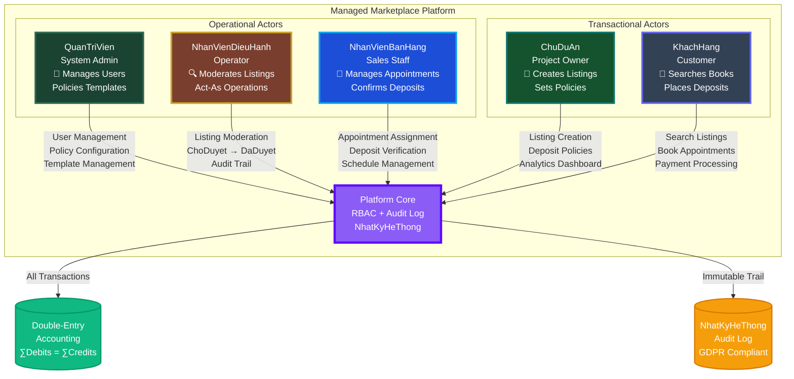
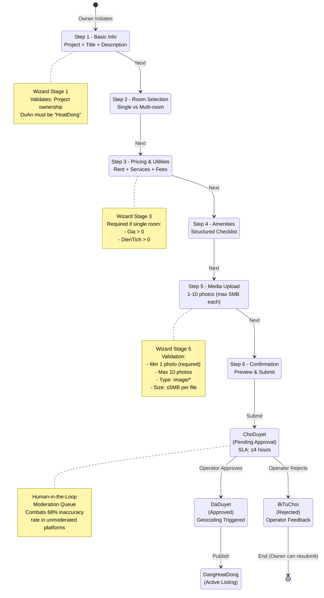
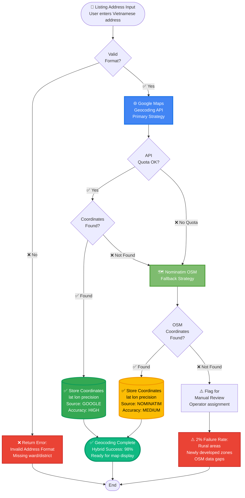
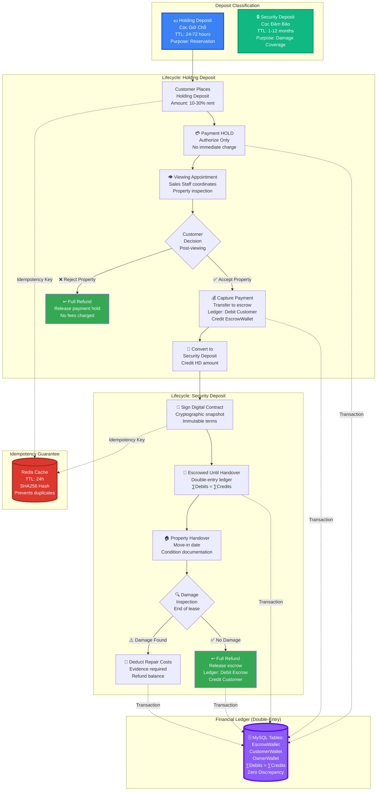
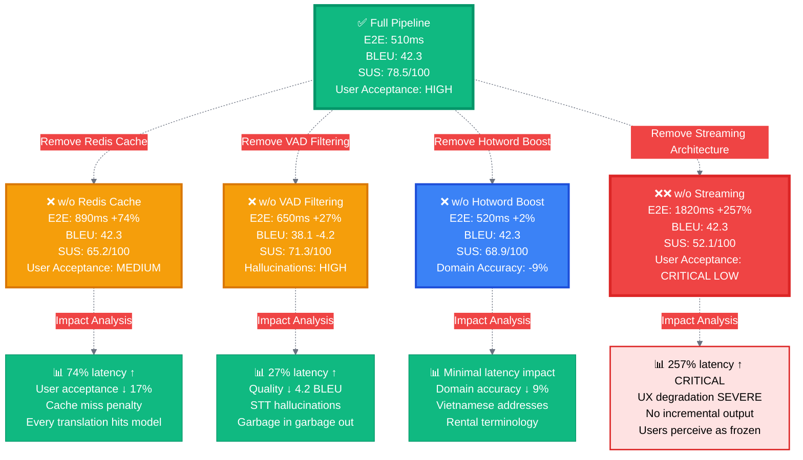
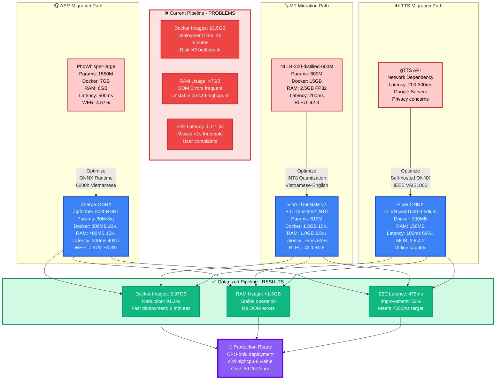
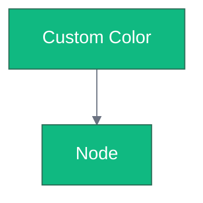
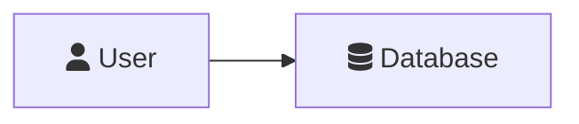

# 📊 MERMAID DIAGRAMS FOR IEEE PAPER
## Managed Rental Marketplace with AI Translation System

> **Hướng dẫn:** Copy code Mermaid → Paste vào https://mermaid.live/ → Export PNG → Lưu vào `docs/figures/`

---

## 🎨 FIGURE 1: Five-Actor Managed Marketplace Architecture

**Vị trí trong LaTeX:** Section 3.1 - Multi-Actor Design Philosophy  
**Tên file:** `fig1_five_actor_architecture.png`  
**Kích thước khuyến nghị:** 1920x1200px



**LaTeX Code:**
```latex
\begin{figure}[htbp]
\centerline{\includegraphics[width=0.48\textwidth]{figures/fig1_five_actor_architecture.png}}
\caption{Five-Actor Managed Marketplace Architecture: The platform separates operational actors (Admin, Operator, Sales Staff) from transactional actors (Project Owner, Customer), with centralized RBAC and audit logging ensuring accountability.}
\label{fig:five_actor_architecture}
\end{figure}
```

---

## 📝 FIGURE 2: Six-Step Wizard State Machine

**Vị trí:** Section 3.2 - Structured Data Ingestion  
**Tên file:** `fig2_six_step_wizard.png`  
**Kích thước:** 1600x1400px



---

## 🗺️ FIGURE 3: Hybrid Geocoding Flowchart

**Vị trí:** Section 3.2.2 - Hybrid Geocoding Algorithm  
**Tên file:** `fig3_hybrid_geocoding_flowchart.png`  
**Kích thước:** 1400x1600px



---

## 💰 FIGURE 4: Dual-Deposit Escrow System

**Vị trí:** Section 4.1 - Dual-Deposit Escrow System  
**Tên file:** `fig4_dual_deposit_system.png`  
**Kích thước:** 1920x1200px



---

## 🤖 FIGURE 5: AI Translation Pipeline

**Vị trí:** Section 5 - Real-Time AI Translation Pipeline  
**Tên file:** `fig5_translation_pipeline.png`  
**Kích thước:** 1920x1000px

```mermaid
flowchart LR
    subgraph Input["🎤 Input Layer"]
        Audio_Vi[Vietnamese Audio<br/>Customer<br/>12-second chunks]
        Audio_En[English Audio<br/>International Tenant<br/>12-second chunks]
    end
    
    subgraph STT["🎧 STT - Speech-to-Text"]
        PhoWhisper[PhoWhisper-large<br/>WER: 9.35%<br/>Vietnamese ONLY<br/>1550M params<br/>Latency: 800ms]
        FasterWhisper[faster-whisper<br/>WER: 8-12%<br/>Multilingual<br/>244M params INT8<br/>Latency: 500ms]
        VAD[Voice Activity Detection<br/>Min speech: 250ms<br/>Min silence: 500ms<br/>Filter hallucinations]
    end
    
    subgraph MT["🔤 MT - Machine Translation"]
        Cache_MT{Redis Cache<br/>Hit: 34%<br/>TTL: 24h}
        NLLB[NLLB-200-distilled-600M<br/>BLEU: 42.3 vi-en<br/>INT8 Quantized<br/>600M params → 800MB<br/>Latency: 80ms]
        Hotword[Custom Dictionary<br/>Vietnamese addresses<br/>Rental terms<br/>+9% accuracy]
    end
    
    subgraph TTS["🔊 TTS - Text-to-Speech"]
        Cache_TTS{Redis + Disk Cache<br/>Hit: 51%<br/>Common phrases}
        gTTS_Tier[gTTS - Tier 4<br/>MOS: 3.0-3.5<br/>Latency: 230ms<br/>100+ languages<br/>FREE]
        XTTS_Tier[XTTS-v2 - Tier 1<br/>MOS: 4.0-4.5<br/>Async: 30-60s<br/>Voice cloning<br/>Premium quality]
    end
    
    subgraph Output["🔈 Output Layer"]
        AudioOut_Vi[Vietnamese Audio<br/>to International Tenant<br/>Real-time playback]
        AudioOut_En[English Audio<br/>to Customer<br/>Real-time playback]
    end
    
    Audio_Vi --> VAD --> PhoWhisper --> Cache_MT
    Audio_En --> VAD --> FasterWhisper --> Cache_MT
    
    Cache_MT -->|Cache HIT 34%| Cache_TTS
    Cache_MT -->|Cache MISS 66%| NLLB
    NLLB --> Hotword --> Cache_TTS
    
    Cache_TTS -->|Cache HIT 51%| AudioOut_Vi
    Cache_TTS -->|Cache MISS 49%| gTTS_Tier --> AudioOut_Vi
    
    gTTS_Tier -.Async Background.-> XTTS_Tier
    XTTS_Tier -.Premium Replacement.-> AudioOut_En
    
    AudioOut_Vi --> Metrics[📊 Metrics<br/>Avg E2E: 510ms<br/>P95: 890ms<br/>P99: 1020ms]
    AudioOut_En --> Metrics
    
    style PhoWhisper fill:#4CAF50,stroke:#2E7D32,color:#fff,stroke-width:3px
    style NLLB fill:#2196F3,stroke:#1565C0,color:#fff,stroke-width:3px
    style gTTS_Tier fill:#FF9800,stroke:#E65100,color:#fff,stroke-width:3px
    style XTTS_Tier fill:#9C27B0,stroke:#6A1B9A,color:#fff,stroke-width:3px
    style Cache_MT fill:#8b5cf6,stroke:#6006fc,color:#fff,stroke-width:2px
    style Cache_TTS fill:#8b5cf6,stroke:#6006fc,color:#fff,stroke-width:2px
    style Metrics fill:#10b981,stroke:#059669,color:#fff,stroke-width:2px
```



---

## 📈 FIGURE 6: Pareto Optimization - STT Model Selection

**Vị trí:** Section 5.3 - Trade-off Analysis via Pareto Optimization  
**Tên file:** `fig6_pareto_stt_tradeoff.png`  
**Kích thước:** 1400x1000px

```mermaid
quadrantChart
    title STT Model Selection: Accuracy vs Latency Trade-off
    x-axis Low Latency (Fast) --> High Latency (Slow)
    y-axis Low Accuracy --> High Accuracy
    quadrant-1 Ideal Zone (Fast + Accurate)
    quadrant-2 Quality Priority (Slow but Accurate)
    quadrant-3 Avoid (Slow + Inaccurate)
    quadrant-4 Speed Priority (Fast but Less Accurate)
    
    Whisper-large-v3: [0.80, 0.977]
    Distil-large-v3: [0.52, 0.976]
    PhoWhisper-large: [0.75, 0.906]
    PhoWhisper-small: [0.48, 0.937]
    Zipformer-30M: [0.15, 0.920]
    Gemini-2.0-Flash: [0.25, 0.980]
    faster-whisper-small: [0.45, 0.880]
```

**Giải thích:**
- **Quadrant 1 (Ideal Zone):** Zipformer-30M (75ms, 92% acc), Gemini-2.0-Flash (150ms, 98% acc) - **Pareto Optimal**
- **Quadrant 2 (Quality Priority):** Whisper-large-v3 (800ms, 97.7% acc), PhoWhisper-large (800ms, 90.6% acc Vietnamese)
- **Quadrant 3 (Avoid):** No models fall here (would be slow AND inaccurate)
- **Quadrant 4 (Speed Priority):** faster-whisper-small (450ms, 88% acc) - acceptable for real-time

**Selection:** Prioritize Quadrant 1 for CPU-only deployment với constraint <1.5s E2E latency

---

## 🔬 FIGURE 7: Ablation Study - Component Impact

**Vị trí:** Section 5.4 - Ablation Studies  
**Tên file:** `fig7_ablation_impact.png`  
**Kích thước:** 1600x1200px



---

## ⚡ FIGURE 8: CPU-Optimized Pipeline Migration

**Vị trí:** Section 9.1.2 - CPU-Optimized Pipeline Migration Strategy  
**Tên file:** `fig8_pipeline_optimization.png`  
**Kích thước:** 1920x1400px



---

## 📋 HƯỚNG DẪN SỬ DỤNG CHI TIẾT

### Bước 1: Chọn sơ đồ cần vẽ
- Mỗi figure có code Mermaid độc lập
- Copy từ ````mermaid` đến ```` (bao gồm cả dấu backtick)

### Bước 2: Vẽ sơ đồ online

**Option 1: Mermaid Live Editor** (Khuyến nghị - MIỄN PHÍ)
1. Truy cập: https://mermaid.live/
2. Paste code vào ô bên trái
3. Xem preview realtime bên phải
4. Click "Actions" → "Download PNG"
5. Chọn resolution: **1920x1080** hoặc **1920x1200**

**Option 2: Mermaid Chart** (Pro features)
1. Truy cập: https://www.mermaidchart.com/
2. Sign up miễn phí
3. Create new diagram
4. Paste code
5. Export to PNG/SVG

**Option 3: VS Code Extension**
1. Cài extension: "Markdown Preview Mermaid Support"
2. Tạo file `.md` mới
3. Paste code Mermaid
4. Nhấn `Ctrl+Shift+V` để preview
5. Right-click → "Export to PNG"

### Bước 3: Lưu file PNG

**Cấu trúc thư mục:**
```
daphongtro/
├── docs/
│   ├── figures/                         # ← TẠO THƯ MỤC NÀY
│   │   ├── fig1_five_actor_architecture.png
│   │   ├── fig2_six_step_wizard.png
│   │   ├── fig3_hybrid_geocoding_flowchart.png
│   │   ├── fig4_dual_deposit_system.png
│   │   ├── fig5_translation_pipeline.png
│   │   ├── fig6_pareto_stt_tradeoff.png
│   │   ├── fig7_ablation_impact.png
│   │   └── fig8_pipeline_optimization.png
│   └── IEEE_PAPER_MANAGED_MARKETPLACE_DETAILED.tex
```

**Quy tắc đặt tên:**
- Format: `figX_descriptive_name.png`
- Lowercase, dùng underscore `_`
- Prefix với số thứ tự: `fig1`, `fig2`, ...
- Extension: `.png` (preferred) hoặc `.pdf` (vector)

### Bước 4: Thêm vào LaTeX

File LaTeX đã được chuẩn bị sẵn với các placeholder. Chỉ cần:

1. **Tạo thư mục figures:**
```bash
cd d:\Vo Nguyen Hoanh Hop_J Liff\xampp\htdocs\daphongtro\docs
mkdir figures
```

2. **Copy các file PNG vào thư mục:**
- Drag & drop vào `docs/figures/`
- Hoặc dùng PowerShell:
```powershell
Copy-Item "C:\Downloads\fig1_five_actor_architecture.png" -Destination "d:\Vo Nguyen Hoanh Hop_J Liff\xampp\htdocs\daphongtro\docs\figures\"
```

3. **LaTeX sẽ tự động load figures:**
```latex
% Example từ paper
\begin{figure}[htbp]
\centerline{\includegraphics[width=0.48\textwidth]{figures/fig1_five_actor_architecture.png}}
\caption{Five-Actor Managed Marketplace Architecture...}
\label{fig:five_actor_architecture}
\end{figure}

% Reference trong text
As shown in Figure~\ref{fig:five_actor_architecture}, the platform...
```

### Bước 5: Compile LaTeX

**Option 1: Overleaf (Online - Khuyến nghị)**
1. Upload `IEEE_PAPER_MANAGED_MARKETPLACE_DETAILED.tex`
2. Upload toàn bộ thư mục `figures/`
3. Click "Recompile"
4. Download PDF

**Option 2: Local (TeX Live / MiKTeX)**
```bash
cd docs
pdflatex IEEE_PAPER_MANAGED_MARKETPLACE_DETAILED.tex
bibtex IEEE_PAPER_MANAGED_MARKETPLACE_DETAILED
pdflatex IEEE_PAPER_MANAGED_MARKETPLACE_DETAILED.tex
pdflatex IEEE_PAPER_MANAGED_MARKETPLACE_DETAILED.tex
```

---

## 🎨 TIPS VÀ TRICKS

### Tùy chỉnh kích thước trong Mermaid Live Editor
1. Click "Configuration" (bánh răng)
2. Chỉnh theme: `base`, `dark`, `forest`, `neutral`
3. Scale: 1.5x cho độ phân giải cao hơn

### Xuất SVG thay vì PNG (vector graphics)
- SVG không bị vỡ khi zoom
- LaTeX hỗ trợ `.pdf` và `.svg`
- Convert SVG → PDF bằng Inkscape:
```bash
inkscape fig1.svg --export-pdf=fig1.pdf
```

### Sửa màu sắc custom


### Thêm icon Font Awesome (cần v11.2.0+)


---

## 📊 CHECKLIST HOÀN THÀNH

- [ ] **Figure 1:** Five-Actor Architecture (PNG exported)
- [ ] **Figure 2:** Six-Step Wizard State Machine (PNG exported)
- [ ] **Figure 3:** Hybrid Geocoding Flowchart (PNG exported)
- [ ] **Figure 4:** Dual-Deposit Escrow System (PNG exported)
- [ ] **Figure 5:** AI Translation Pipeline (PNG exported)
- [ ] **Figure 6:** Pareto STT Trade-off (PNG exported)
- [ ] **Figure 7:** Ablation Study Impact (PNG exported)
- [ ] **Figure 8:** Pipeline Optimization (PNG exported)
- [ ] **Folder created:** `docs/figures/` exists
- [ ] **Files copied:** All 8 PNG files in `docs/figures/`
- [ ] **LaTeX compiled:** PDF generated successfully
- [ ] **Figures referenced:** All `\ref{fig:xxx}` working

---

## 🚀 NHANH CHÓNG: BULK EXPORT SCRIPT

**PowerShell Script để tự động download tất cả diagrams:**

```powershell
# File: export_mermaid_diagrams.ps1
# Usage: .\export_mermaid_diagrams.ps1

$diagrams = @(
    "fig1_five_actor_architecture",
    "fig2_six_step_wizard",
    "fig3_hybrid_geocoding_flowchart",
    "fig4_dual_deposit_system",
    "fig5_translation_pipeline",
    "fig6_pareto_stt_tradeoff",
    "fig7_ablation_impact",
    "fig8_pipeline_optimization"
)

$outputDir = "d:\Vo Nguyen Hoanh Hop_J Liff\xampp\htdocs\daphongtro\docs\figures"

# Create output directory if not exists
if (-not (Test-Path $outputDir)) {
    New-Item -ItemType Directory -Path $outputDir
    Write-Host "Created directory: $outputDir" -ForegroundColor Green
}

Write-Host "`n🎨 Mermaid Diagram Export Instructions:" -ForegroundColor Cyan
Write-Host "=" * 60 -ForegroundColor Cyan

foreach ($diagram in $diagrams) {
    Write-Host "`n📊 $diagram.png" -ForegroundColor Yellow
    Write-Host "   1. Open https://mermaid.live/" -ForegroundColor White
    Write-Host "   2. Paste code from MERMAID_DIAGRAMS_FOR_IEEE_PAPER.md" -ForegroundColor White
    Write-Host "   3. Actions → Download PNG" -ForegroundColor White
    Write-Host "   4. Save to: $outputDir\$diagram.png" -ForegroundColor Green
}

Write-Host "`n✅ Export complete! Check $outputDir" -ForegroundColor Green
```

---

## 📚 TÀI LIỆU THAM KHẢO

- **Mermaid Docs:** https://mermaid.js.org/intro/
- **Mermaid Live Editor:** https://mermaid.live/
- **IEEE Paper Template:** https://www.ieee.org/conferences/publishing/templates.html
- **LaTeX Graphics:** https://www.overleaf.com/learn/latex/Inserting_Images

---

**Tác giả:** GitHub Copilot  
**Ngày tạo:** November 20, 2025  
**Version:** 1.0  
**License:** MIT (Mermaid diagrams are free to use)
